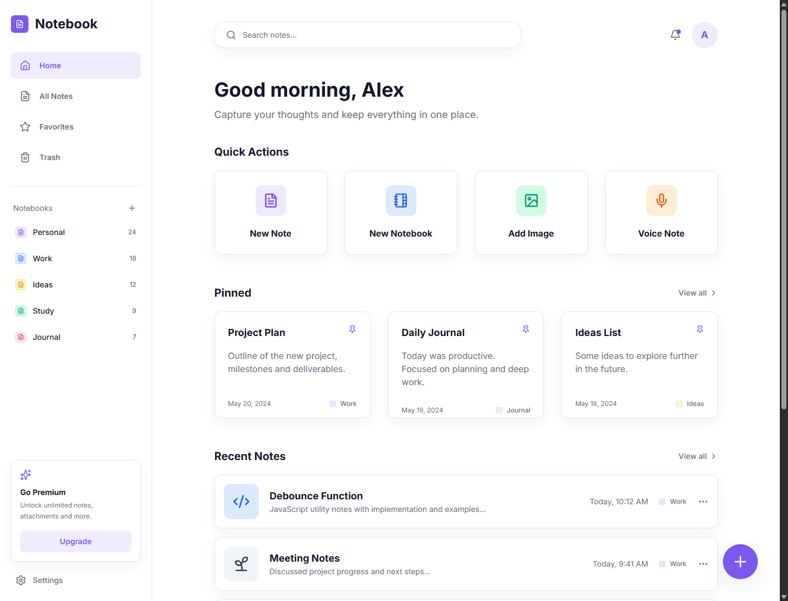

# Premium Notebook & Journal App

A modern, high-performance, and visually stunning Notebook and Journaling application built with React, Tailwind CSS, and Framer Motion. This app features rich-text editing, multi-page notes, and ultra-vibrant code snippets.



## ✨ Features

- **🚀 Professional Code Editor**: 
  - Real-time syntax highlighting with an "Ultra Vibrant" palette.
  - Sticky code headers with language selectors and copy functionality.
  - Dynamic height adjustment as you type.
- **📖 Multi-Page Support**: Organize complex notes into multiple pages within a single entry.
- **🎨 Premium UI/UX**: 
  - Smooth transitions using Framer Motion.
  - Modern, clean aesthetic with customizable Sticky Notes.
  - Sidebar navigation and responsive layout.
- **✍️ Rich Journaling**: 
  - Support for headers, checklists, tables, and bullet points.
  - Content-editable sections for a seamless writing experience.
- **📂 Organization**: 
  - Tagging system for easy search and categorization.
  - Folder-based organization (Notebooks).
  - Favorites and Trash management.

## 🛠️ Tech Stack

- **Frontend**: React (Vite)
- **Styling**: Tailwind CSS
- **Animations**: Framer Motion
- **Icons**: Lucide React
- **Syntax Highlighting**: Prism.js
- **State Management**: React Context API
- **Persistence**: LocalStorage (Supabase-ready)

## 🚀 Getting Started

### Prerequisites
- Node.js (v18 or higher)
- npm or yarn

### Installation

1. Clone the repository:
   ```bash
   git clone https://github.com/YOUR_USERNAME/premium-notebook-app.git
   ```

2. Navigate to the project directory:
   ```bash
   cd premium-notebook-app
   ```

3. Install dependencies:
   ```bash
   npm install
   ```

4. Start the development server:
   ```bash
   npm run dev
   ```

## 📦 Build for Production

To create a production-ready build:
```bash
npm run build
```

## 📄 License

This project is licensed under the MIT License - see the [LICENSE](LICENSE) file for details.

## 🙏 Acknowledgments

- Inspired by premium writing and productivity tools.
- Built with love using the modern React ecosystem.
